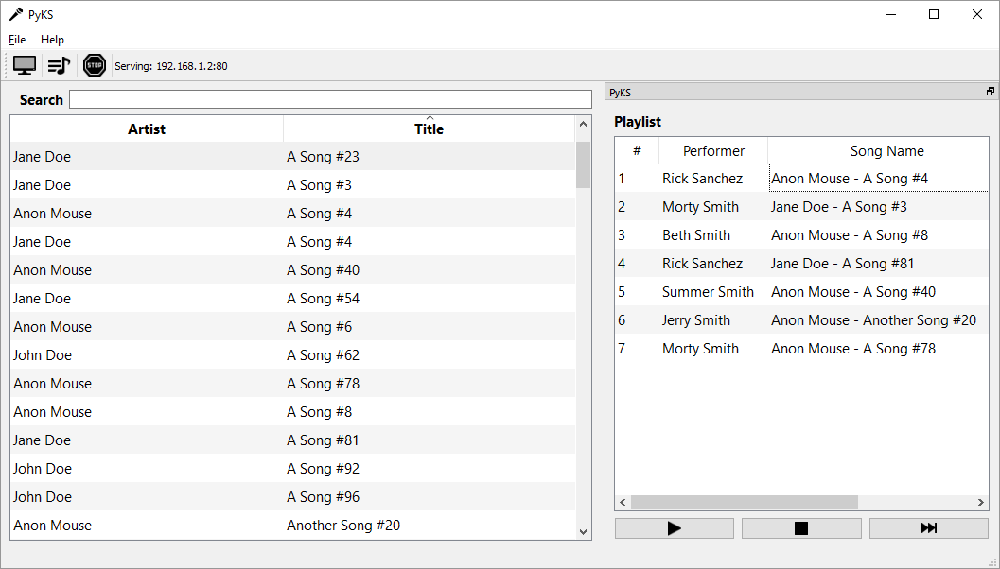
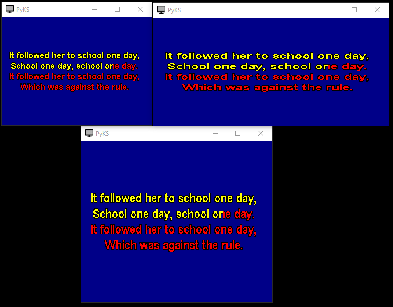
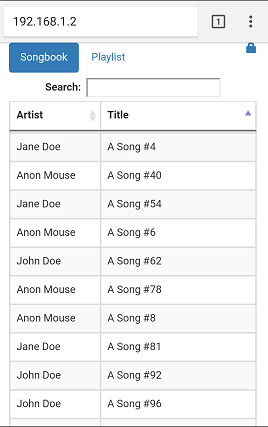
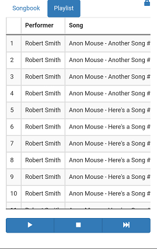

# PyKS

PyKS (short for Python Karaoke Server) is a free and open source cross 
platform CD+G/MP3 karaoke player. Not only is PyKS a full fledged karaoke 
player, but it also contains a web interface allowing anyone connected to 
your network to easily view your songbook, search for songs, and add songs to 
the queue through their mobile device!

## Getting Started

PyKS is written in Python3 and requires the
<a href=https://www.python.org/downloads/ target="_blank">Python 3.5+</a>
interpreter to be installed.

### Prerequisites

PyKS makes extensive use of
<a href=https://www.riverbankcomputing.com/software/pyqt/download5 target="_blank">PyQt5</a>
and <a href=http://www.numpy.org/ target="_blank">NumPy</a>. Installation
instructions can be found on their respective websites.

Alternatively, both PyQt5 and NumPy can be installed through the pip package
manager.
```
pip3 install pyqt5
```
and
```
pip3 install numpy
```

##### Special Linux Considerations

PyKS utilizes the QtMultimedia module which requires the separate installation
of the `libqt5multimedia5-plugins` package.
```
sudo apt-get install libqt5multimedia5-plugins
```

## Installation
1. Download or clone this repository.
```
git clone https://gitlab.com/tschen/PyKS.git
```
2. Run PyKS from the command line 
```
python pyks.py
```

## User Guide
See the [user guide](USER_GUIDE.md) for more info on how to set up PyKS.

## PyKS Images
Here are some images of PyKS highlighting a few of its features.  

  
Search the songbook and view the current playlist   
<br>

  
Open multiple lyrics windows for multiple external displays  
<br>

  
View and select songs from the web app  
<br>

  
Control the karaoke player from the web app  
<br>

## Built With

* [PyQT](https://www.riverbankcomputing.com/software/pyqt/intro)
* [NumPy](http://www.numpy.org/)
* [jQuery](https://jquery.com/)
* [jQueryUI](https://jqueryui.com/)
* [Bootstrap](https://getbootstrap.com/)
* [DataTables](https://datatables.net/)

## Author

* **Tim Chen** - [pyks.info@gmail.com](mailto:pyks.info@gmail.com)

## License

This project is licensed under GPLv3 - see the [LICENSE](LICENSE) file 
for details.

## Thanks

* [Jim Bumgardner](https://jbum.com/) and his guide on the 
CD+G specification,
[CD+G Revealed: Playing back Karaoke tracks in Software](https://jbum.com/cdg_revealed.html)
* The creators of [PyKaraoke](https://www.kibosh.org/pykaraoke/) 
which influenced many aspects of PyKS.