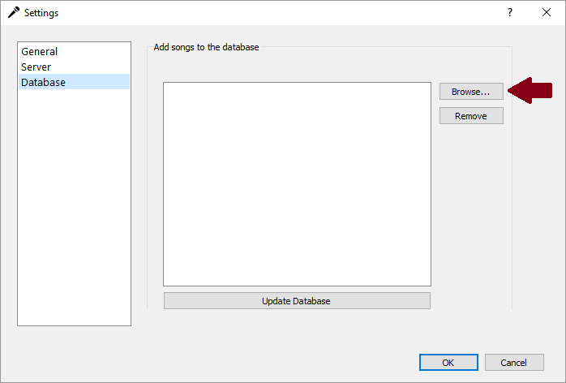
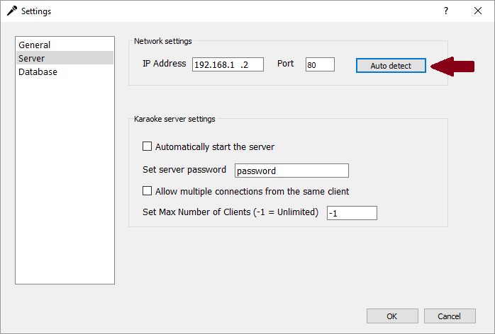
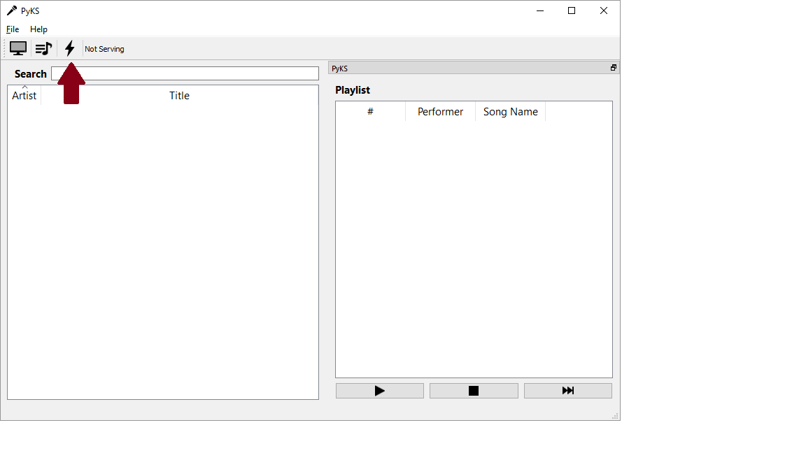
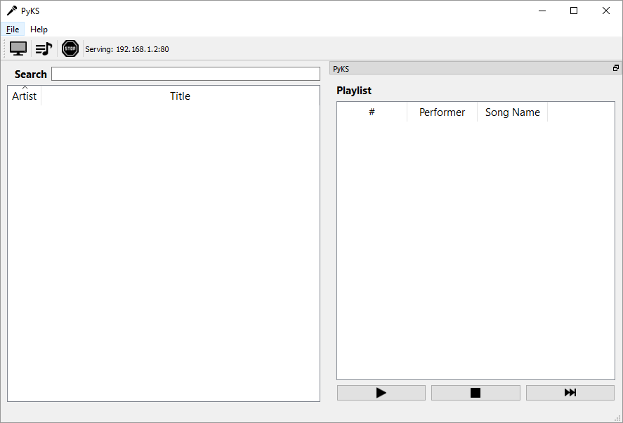

# PyKS

PyKS (short for Python Karaoke Server) is a free and open source cross 
platform CD+G/MP3 karaoke player. Not only is PyKS a full fledged karaoke 
player, but it also contains a web interface allowing anyone connected to 
your network to easily view your songbook, search for songs, and add songs to 
the queue through their mobile device!

## Getting Started

PyKS is written in Python3 and requires the
<a href=https://www.python.org/downloads/ target="_blank">Python 3.5+</a>
interpreter to be installed.

### Prerequisites

PyKS makes extensive use of
<a href=https://www.riverbankcomputing.com/software/pyqt/download5 target="_blank">PyQt5</a>
and <a href=http://www.numpy.org/ target="_blank">NumPy</a>. Installation
instructions can be found on their respective websites.

Alternatively, both PyQt5 and NumPy can be installed through the pip package
manager.
```
pip3 install pyqt5
```
and
```
pip3 install numpy
```

##### Special Linux Considerations

PyKS utilizes the QtMultimedia module which requires the separate installation
of the `libqt5multimedia5-plugins` package.
```
sudo apt-get install libqt5multimedia5-plugins
```

## Installation
1. Download or clone this repository.
```
git clone https://gitlab.com/tschen/PyKS.git
```
2. Run PyKS from the command line 
```
python pyks.py
```

## Quickstart
Before throwing that awesome karaoke party, you first need to create a songbook
and (optionally) set up the karaoke server.

#### Creating the Songbook
To create the songbook, go to `File->Settings->Database` and browse for the 
folder(s) containing your CD+G/MP3 files.





After adding your karaoke folder(s), click `OK`. PyKS will now scan through
your folder(s) looking for CD+G files and their corresponding MP3 files.

Some notes about filenames:
* In order for PyKS to parse song names correctly, filenames must follow the
_artist - title_ naming convention (e.g. `Journey - Don't Stop Believin'.cdg`
and `Journey - Don't Stop Believin'.mp3`).
* A CD+G file and its corresponding MP3 file must share the same filename.

#### Setting Up the Karaoke Server
To setup the karaoke server, go to `File->Settings->Server`. In the 
"Network settings" ,
you can either manually enter your computer's IP address and an open port or 
click `Auto detect` to have PyKS automatically determine these values.





After inputting your network settings, click `OK`.

Now, in the main PyKS window, click the lightning bolt toolbar button to 
start the server.



If all goes well, the lightning bolt icon will change to a stop sign and the 
"Not serving" text will be replaced by the IP address and port of the karaoke 
server.



Once the server is up and running, anyone connected to your network (i.e. 
connected to your router via WiFi) will be able to access your songbook, search 
for songs, and add songs to the queue by pointing their browser to your karaoke 
server's address and port. You can also stop the server at any time by clicking 
the stop sign toolbar button.

**Note:** if your server is not serving on port 80, you must type in the IP
address **along with the port** in your browser. For example, if my karaoke 
server is serving at IP address 192.168.1.2 and port 1204, I would type 
`192.168.1.2:1204` in my browser. If the server _is_ serving on port 80, you 
only need to type in the IP address.


## Built With

* [PyQT](https://www.riverbankcomputing.com/software/pyqt/intro)
* [NumPy](http://www.numpy.org/)
* [jQuery](https://jquery.com/)
* [jQueryUI](https://jqueryui.com/)
* [Bootstrap](https://getbootstrap.com/)
* [DataTables](https://datatables.net/)

## Author

* **Tim Chen** - [pyks.info@gmail.com](mailto:pyks.info@gmail.com)

## License

This project is licensed under GPLv3 - see the [LICENSE](LICENSE) file for details

## Thanks

* [Jim Bumgardner](https://jbum.com/) and his guide on the 
CD+G specification,
[CD+G Revealed: Playing back Karaoke tracks in Software](https://jbum.com/cdg_revealed.html)
* The creators of [PyKaraoke](https://www.kibosh.org/pykaraoke/) 
which influenced many aspects of PyKS.