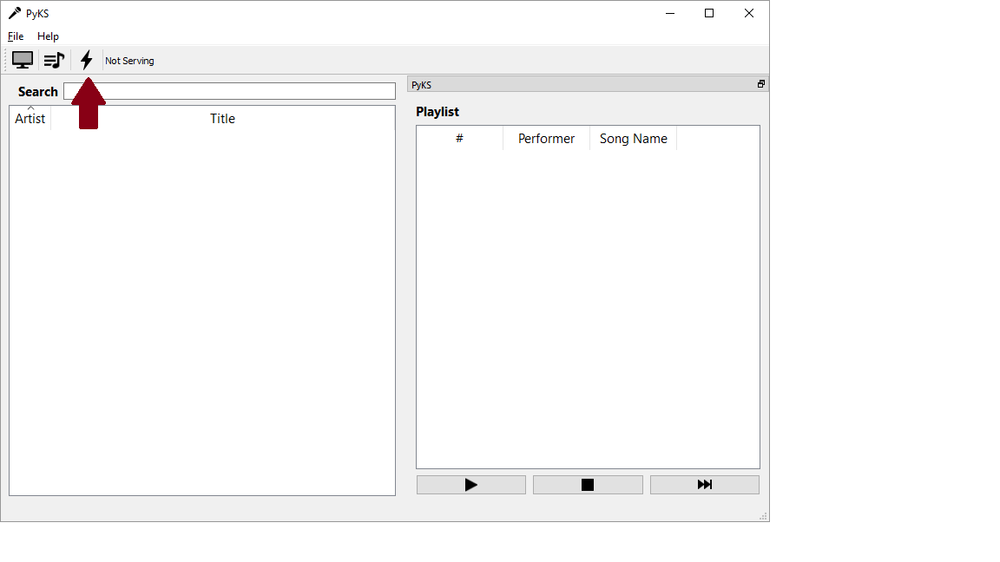
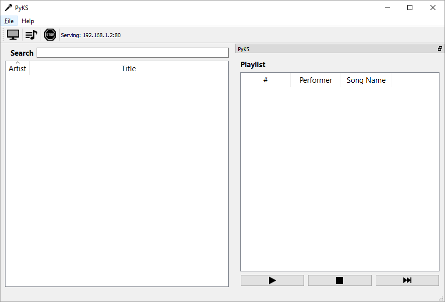
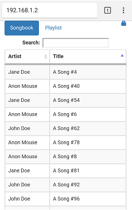

## Table of Contents

  <ol>
    <li><a href="#Quickstart">Quickstart</li>
    <li><a href="#PlayerOverview">Karaoke Player Overview
      <ol type=i>
        <li><a href="#MainWindow">Main Window</li>
        <li><a href="#SettingsWindow">Settings Window</li>
      </ol>
    <li><a href="#PlayerModes">Karaoke Player Modes</li>
      <ol type=i>
        <li><a href="#SongQueue">Song Queue</li>
      </ol>
    <li><a href="#WebApp">Web App
      <ol type=i>
        <li><a href="#WebAppControls">Enabling Web App Controls</li>
      </ol>
    </li>
  </ol>

## Quickstart
Before throwing that awesome karaoke party, you first need to create a songbook
and (optionally) set up the karaoke server.

#### Creating the Songbook
To create the songbook, go to `File->Settings->Database` and browse for the 
folder(s) containing your CD+G/MP3 files.

After adding your karaoke folder(s), click `OK`. PyKS will now scan through
your folder(s) looking for CD+G files and their corresponding MP3 files.

Some notes about filenames:
* In order for PyKS to parse song names correctly, filenames must follow the
_artist - title_ naming convention (e.g. `Journey - Don't Stop Believin'.cdg`
and `Journey - Don't Stop Believin'.mp3`).
* A CD+G file and its corresponding MP3 file must share the same filename and
end with the `.cdg` and `.mp3` extensions respectively.

#### Setting Up the Karaoke Server
To setup the karaoke server, go to `File->Settings->Server`. In 
"Network settings" ,
you can either manually enter your computer's IP address and an open port or 
click `Auto detect` to have PyKS automatically determine these values.

After inputting your network settings, click `OK`.

Now, in the main PyKS window, click the lightning bolt toolbar button to 
start the server.

If all goes well, the lightning bolt icon will change to a stop sign and the 
"Not serving" text will be replaced by the IP address and port of the karaoke 
server.

Once the server is up and running, anyone connected to your network (e.g. 
connected to your router via Wi-Fi) will be able to access your songbook, search 
for songs, and add songs to the queue by directing their browser to your karaoke 
server's address and port. You can also stop the server at any time by clicking 
the stop sign toolbar button.

**Note:** if your server is not serving on port 80, you must type in the IP
address **along with the port** in your browser. For example, if my karaoke 
server is serving at IP address 192.168.1.2 and port 1204, I would type 
`192.168.1.2:1204` in my browser. If the server _is_ serving on port 80, you 
only need to type in the IP address.

## Karaoke Player Overview
The following sections give an overview of the main parts of the
karaoke player and explain how to access and modify various PyKS settings.

#### Main Window
  
1. **Search Bar:** 
Enter your search string in the search bar to search for a specific 
artist or song title. Special characters such as apostrophes('), 
commas(,), periods(.), and hyphens(-) are ignored (e.g.
searching for don't vs dont will produce the same search results).  

2. **New Lyrics Window Button:**
Clicking this button opens a new Lyrics Window. If you have several external 
displays, you can open multiple Lyrics Windows and move them to each display. 
Lyrics Windows can be stretched and resized by dragging any corner and can be 
set to **full screen mode by double clicking** anywhere within the window.  

  

3. **Song Queue Button:**
Clicking this button opens the Song Queue. When the Song Queue is open, 
all songs are added to the Song Queue Window rather than the Playlist Window.
Songs in the Song Queue will not be visible to others until you move them
to the Playlist Window. This gives you an opportunity to rearrange songs 
privately to create the perfect karaoke playlist before making that playlist
visible to everyone.

4. **Server Start/Stop:** 
Clicking the server start/stop button starts and stops the karaoke server. 
When the server is stopped, guests will no longer be able to add songs to 
the playlist using the web app.

5. **Server Status:**
This text indicates whether or not the server is currently active, and if so,
 which IP address and port are being used by the server.

#### Settings Window
The settings window can be accessed by going to `File->Settings...`

##### General Settings
  
1. Clicking this checkbox toggles
the karaoke player between "Performer Mode" and "Non Performer Mode." See 
[karaoke player modes](#PlayerModes) for more information about these two 
modes.  

2. When in "Performer Mode", 
checking this checkbox will open the Song Queue on startup.  

3. This is the number of seconds
to wait before autoplaying the next songs. A value of -1 means to stop 
playback at the end of each song (i.e. at the end of each song, the player 
stops, and the next song  doesn't play until the play button is manually 
clicked).

##### Server Settings
  
1. Either manually enter the IP
address and open port of the computer running PyKS or click "Auto Detect"
to allow PyKS to automatically determine these values. The IP address will
be used by the web server to host the web app.  

2. Checking this box will
automatically start the web server on startup using the last used IP 
address and port.

3. This password is used within
the web app to enable karaoke player controls. More information can be found
in the [Enabling Web App Controls](#WebAppControls) section of this document.  

4. Checking this box allows a
single client computer to make multiple connections to the server. In most 
cases, you'll want to keep this option unchecked which will prevent someone
from connecting multiple browser tabs to the karaoke server.

5. This value sets the maximum
number of clients that can be connected to the web server simultaneously.
A value of -1 means an unlimited number of clients can be connected.

##### Database Settings
  
1. The search folder text area
lists the selected folder(s) which will be searched for karaoke CD+G/MP3 
files.

2. Clicking the `Browse` button
opens a file browser window where you can select the folder(s) which contain 
your karaoke songs.  

3. After selecting one or more folders,
click the remove button to remove them from your karaoke songbook database.   

4. Clicking `Update Database` will
cause your karaoke database to be rebuilt.  

## Karaoke Player Modes
PyKS has two modes - "Performer mode" and "Non Performer Mode." These
two modes are toggled on and off through the [General Settings](#GeneralSettings) 
menu by checking or unchecking the "Performer Mode" checkbox.  

The difference between the two modes lies in how songs are added to the 
playlist.  

In "Performer Mode", when adding a song, a dialog box will appear prompting
you to enter a performer's name.

  

In  "Non Performer Mode," songs are directly added to the playlist without
a performer prompt.

#### Song Queue

In "Performer Mode", you can open the song queue by clicking the
[song queue](#MainWindow) button in the toolbar (the button disappears
in "Non Performer Mode". When the song queue is
open, songs are added to the queue rather than the playlist and must be 
manually moved (either by drag and drop or double clicking) to the 
playlist. This gives you an opportunity to rearrange the playlist to 
better balance song requests before pushing them out to the public.

## Web App
PyKS contains a web app which allows guests on your Wi-Fi network
to add songs and view the current playlist through a browser on their
connected device (e.g. cell phone, tablet, laptop, etc).  

To access the web app, guests need to sign into your Wi-Fi network and point
their browser to your karaoke server's IP address. For information on how to 
set up the server, see [Server Settings](#ServerSettings).

  

#### Enabling Web App Controls
From the web app, authorized users can access karaoke playback controls 
by entering in the server password that was setup in the 
[Server Settings](#ServerSettings) menu.  

To unlock the playback controls, first click on the lock icon in the upper
right hand corner of the screen.

Next, enter the password that was set up in the main application and 
click `OK`.

  

If the correct password is entered, karaoke playback controls will
appear at the bottom of the screen.

  
